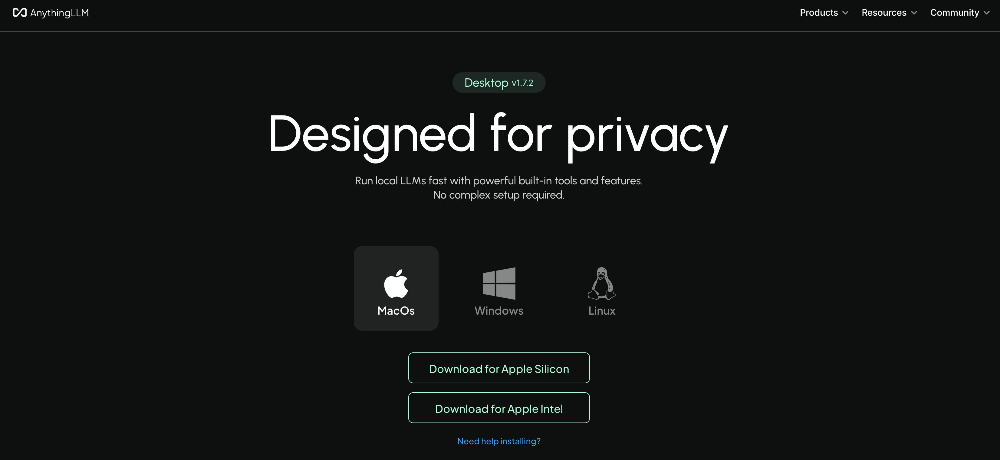
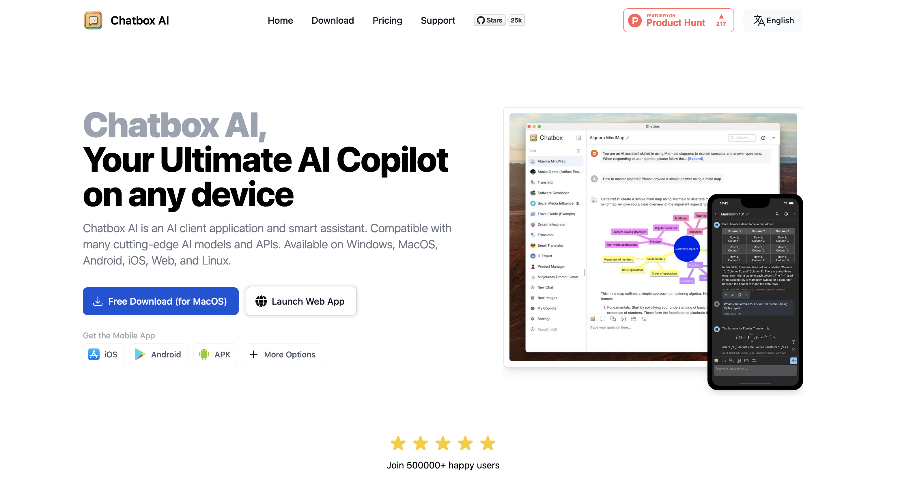

# Examples of using your AI-VERDE API Token in MacOS

Adding AI-Verde to ai platforms takes your chatbot to the next level with smarter, faster AI-powered responses. For everyday tasks like customer support, coding help, or data analysis, making your chatbot more versatile. Best of all, AI-Verde's integration works with most chatbot systems!

# **AnythingLLM**
## 1. Download AnythingLLM 
Download [AnythingLLM](https://anythingllm.com/) into your Desktop and select the version best suited for yur device 
 
  {: style="width:80%"}   

Note: 
- Apple Silicon offers faster performance and better energy efficiency compared to Intel processors. 
- Apple Intel in Macs offer broad compatibility with older software, better support for running Windows, and more hardware upgrade options.

## 2. Imput Provider 
Go to open settings on the lower right-handside
select AI Provider and LLM  
Imput Generic OpenAI as LLM Provider 
Add your Base URL, API Key and Chat Model Name

  {: style="width:80%"}

  ## 3. Start Chatting with Verde
  {: style="width:80%"}
___
# **Chatbox**
## 1. Log in Chatbox 
Log in [Chatbox](https://web.chatboxai.app/) on desktop or lunch in web app. 
{: style="width:80%"}
## 2. Go into Settings 
Imput all the elements such as Model Provider, API Key, etc. 

{: style="width:80%"}

## 3. Start Chatting 
{: style="width:80%"}

