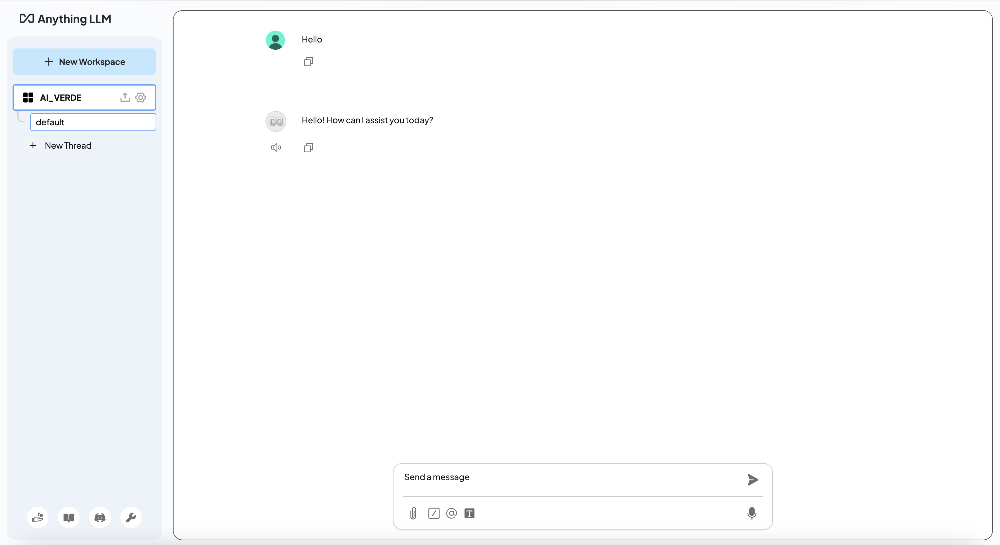
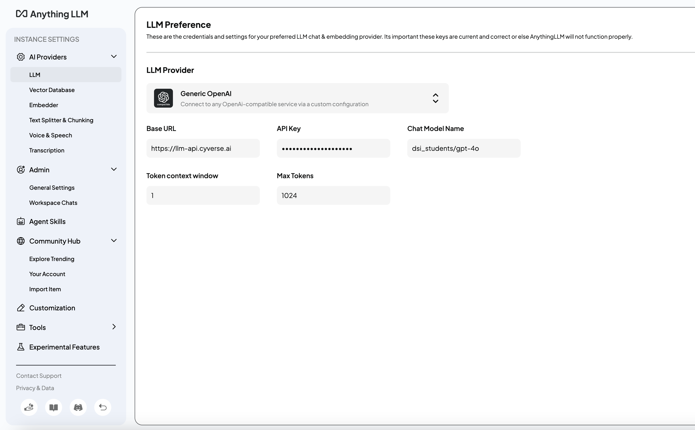
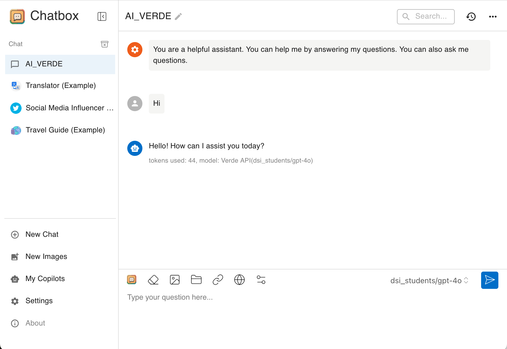
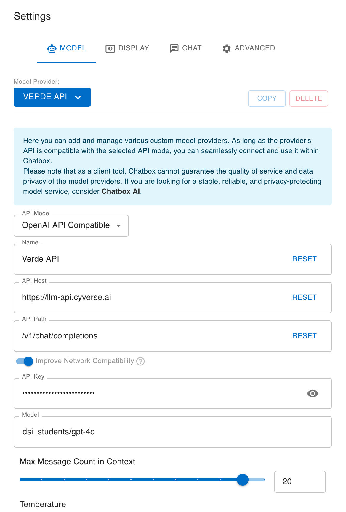

# Examples of using your AI-VERDE API Token in MacOS

Adding AI-Verde to ai platforms takes your chatbot to the next level with smarter, faster AI-powered responses. It’s perfect for everyday tasks like customer support, coding help, or data analysis, making your chatbot much more versatile. Best of all, AI-Verde's integration works great with most chatbot systems!

# **AnythingLLM**
  {: style="width:80%"}
  {: style="width:80%"}
___
# **Chatbot**
{: style="width:80%"}
{: style="width:80%"}