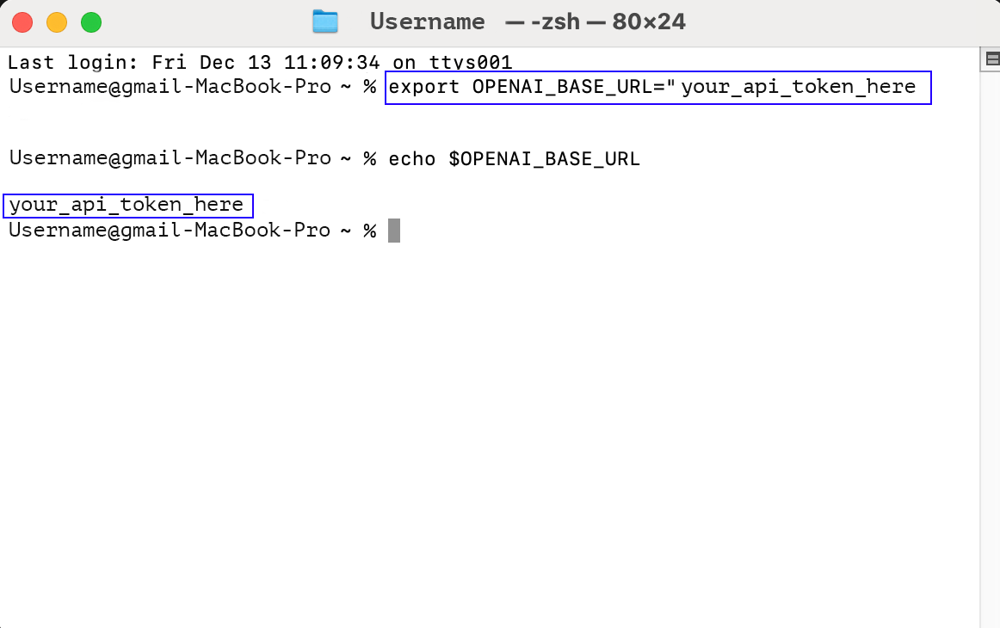
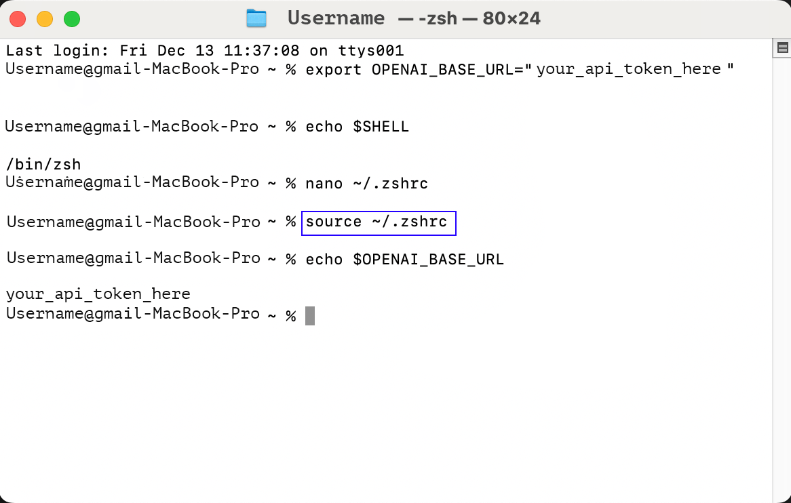
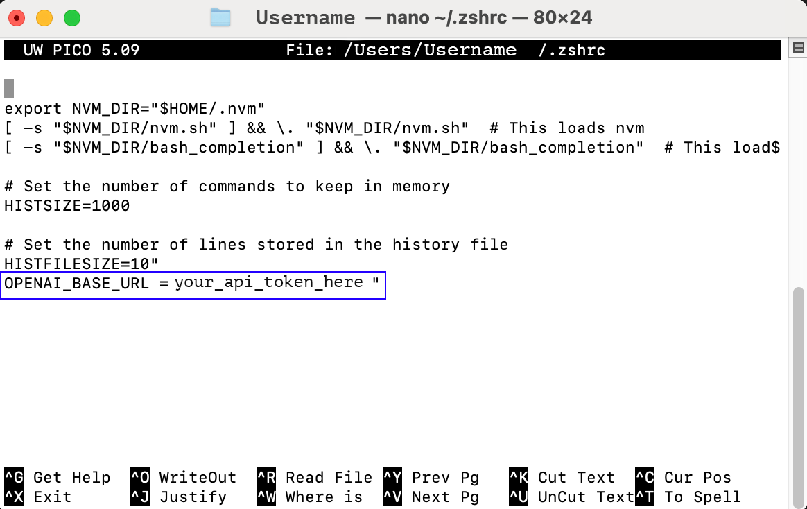
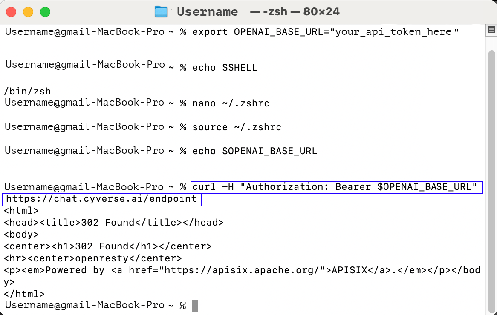

# Step-by-Step Guide: Using an API Token on macOS

This tutorial explains how to securely use an API token on macOS.

## Steps to Use an API Token

## Step 1: Open Terminal
1. Launch the Terminal application on your Mac:
   - Use `Command + Space` to open Spotlight.
   - Type `Terminal` and press `Enter`.   
      {: style="width:50%"}

---

## Step 2: Store the API Token in an Environment Variable

1. Use a secure method to store the token:    
   ```export OPENAI_BASE_URL= "your_api_token_here"```
2. To make it persistent across sessions, add the line to your shell profile file:
- For zsh (default in macOS):
    
    ```echo export OPENAI_BASE_URL="your_api_token_here" >> ~/.zshrc```
- For bash:
    ```echo export OPENAI_BASE_URL="your_api_token_here" >> ~/.bash_profile```

- Apply the changes:
    - For zsh ```source ~/.zshrc```   
    - For bash ```source ~/.bash_profile```  
{: style="width:50%"}

---

## Step 3: Verify the Variable 

### Step 3.1: Determine Your Shell

Check which shell you’re using by running:      
   ```echo $SHELL```

- If the output is /bin/zsh, your configuration file is ```~/.zshrc.```
- If the output is /bin/bash, your configuration file is```~/.bash_profile.```

### Step 3.2: Open the Configuration File

Open the appropriate file in a text editor:

- For zsh: ```nano ~/.zshrc```

- For bash: ```nano ~/.bash_profile```

### Step 3.3: Add the Token

- Add the following line to the file:   
    
  ```export OPENAI_BASE_URL="your_api_token_here"```

### Step 3.4: Save and Exit

   In ```nano```, ```press Ctrl + O``` to save the file.
    Press ```Enter``` to confirm.
    Press ```Ctrl + X``` to exit.

- . Confirm the token is set correctly: 
  
  ``` echo $OPENAI_BASE_URL``` 
- The terminal should display your token 

 {: style="width:50%"}
---
## Step 4: Use the API Token in a cURL Request 


-  To test the token, use it in an API call:    
    ```curl -H "Authorization: Bearer $OPENAI_BASE_URL" https://chat.cyverse.ai/endpoint```

{: style="width:50%"}

---
## Step 5: Secure your Token 
1. Avoid hardcoding tokens in scripts.
2. Use .env files with tools like dotenv for larger projects.
3. Revoke unused or compromised tokens.

## Troubleshooting

- Token not found: Ensure you used source to reload your shell configuration.
- Permission denied: Check the file permissions of your shell profile.

## You're all set! 🎉 You can now use your API token securely on macOS.