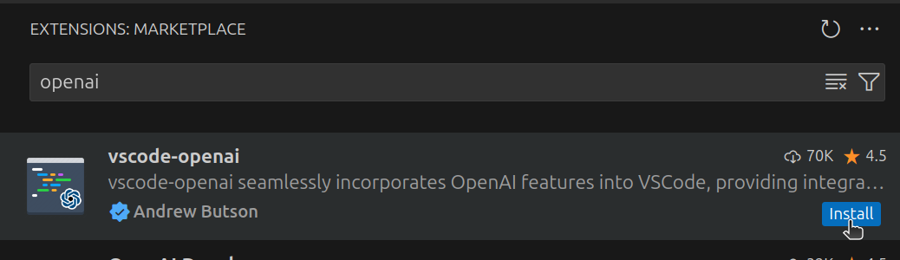
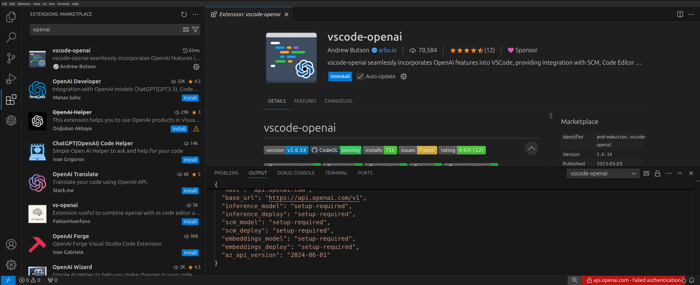
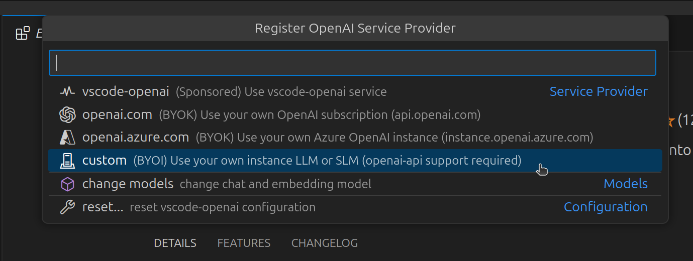
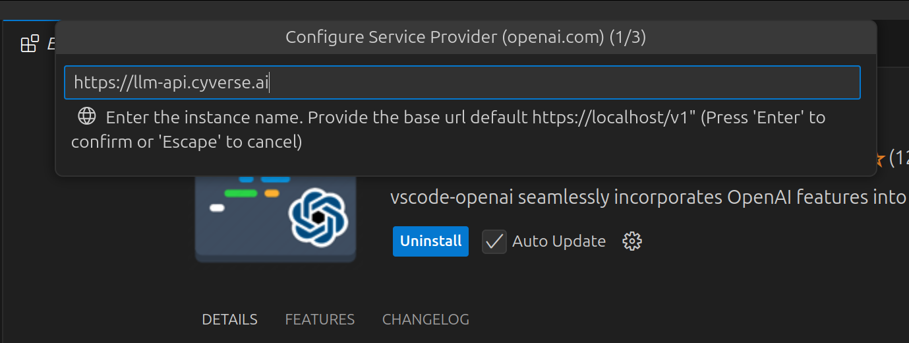
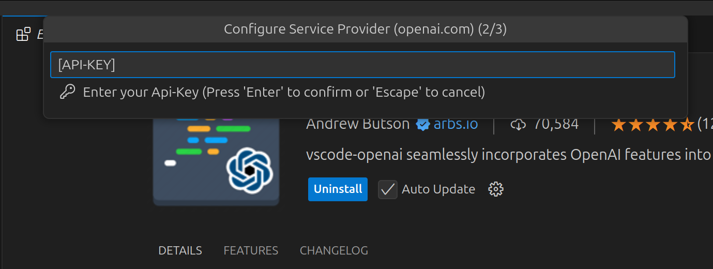
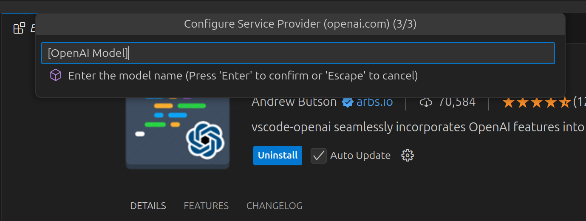
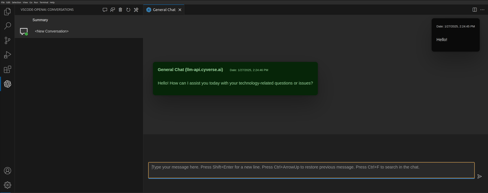
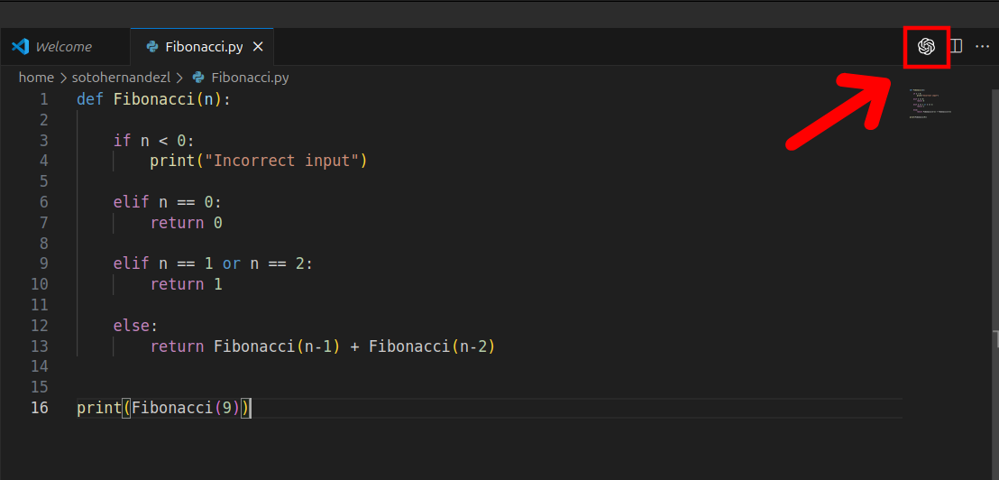

# Examples of using your AI-VERDE API Token in VSCode

## OpenAI
!!! Note "Check if you have access to an OpenAI model by running the following command and looking for OpenAI model ID's (i.e. gpt-4o, gpt-4o-mini). These ID's correspond to the model name" 
    ```bash
    curl -s -L "https://llm-api.cyverse.ai/v1/models" -H "Authorization: Bearer [AI-VERDE API KEY]" -H 'Content-Type: application/json'|jq
    ```
### 1. Install the "vscode-openai" extension
Within the extension marketplace, a simple search for OpenAI yields the desired extension.


---
### 2. Configure the extension

Once installed, a red bar with a "failed authentication" error will appear:


---
Selecting this red bar will bring out a new menu. In case you need to access this menu again, pressing the bar again will bring it up.

In the new menu, select "custom" among the dropdown list


---
The menu will then prompt or an API URL, API key, and model name






!!! Warning "The OpenAI model name must match one of the ID's output by the curl command" 
---

### 3. Using the extension
The extension has chat functionality accessed from the leftmost bar in Visual Studio:


The extension also provides insights to your code directly via the OpenAI logo

