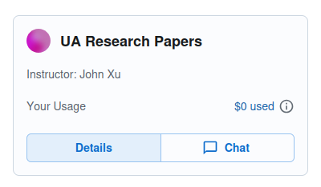
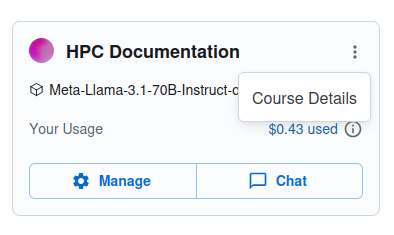
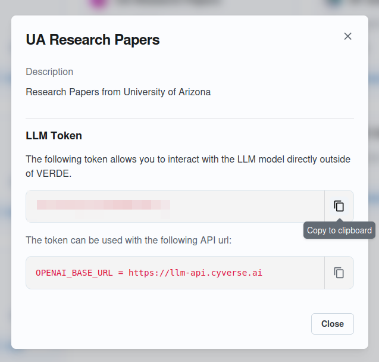

# Obtaining your AI-VERDE API Token

## 1. Sign In

1. Go to [https://chat.cyverse.ai/](https://chat.cyverse.ai/){target=_new}.
2. Click **Sign In**.
3. Sign in with your NetID.

## 2. Select Your Team or Course

### As a student, click **Details**

{: style="width:75%"}

### As an instructor, click the vertical ... and then click **Course Details**

{: style="width:75%"}

### Save your API key somewhere safe

{: style="width:75%"}
