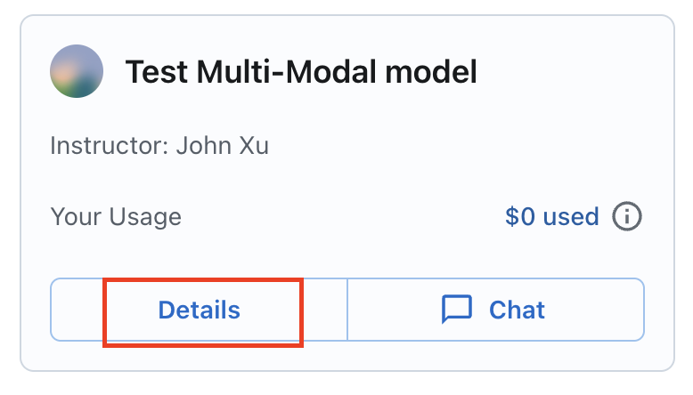
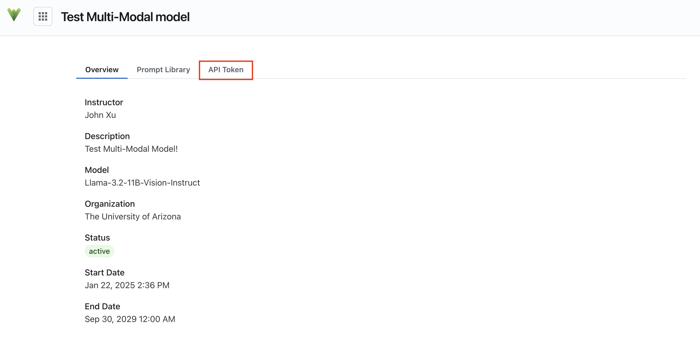
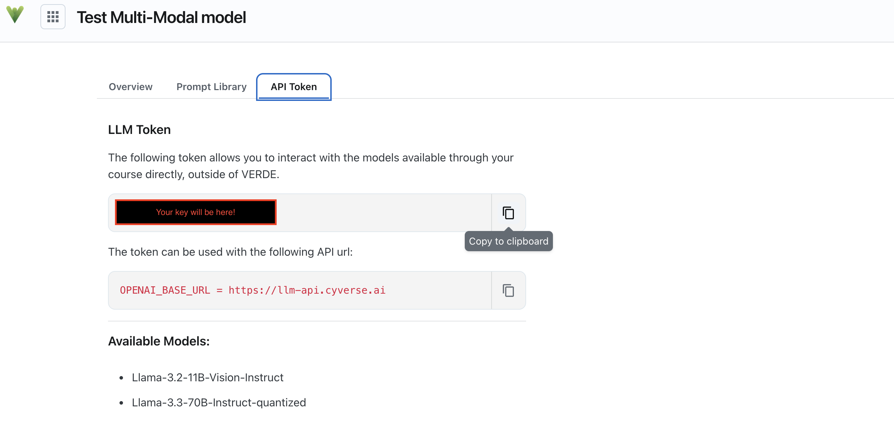

# Obtaining your AI-VERDE API Token

## 1. Sign In

1. Go to [https://chat.cyverse.ai/](https://chat.cyverse.ai/){target=\_new}.
2. Click **Sign In**.
3. Sign in with your NetID.

## 2. Select Your Team or Course

Click the "Details" button:

{: style="width:75%"}

## 3. Click the "API Token" tab:

{: style="width:75%"}

## 4. Copy and save your API key

{: style="width:75%"}

The models available for your course will are listed in the "Available Models" section of the API Token page.
