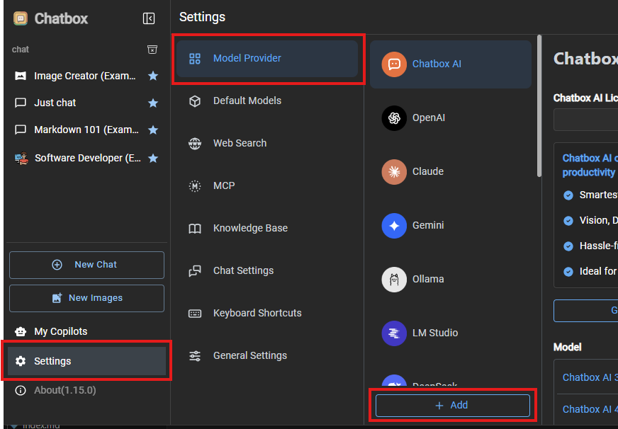
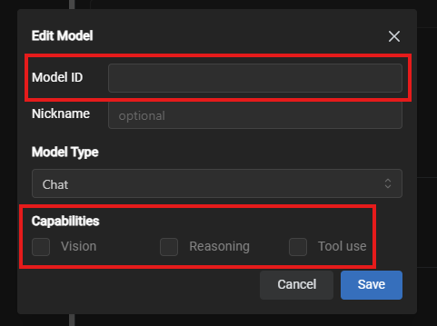
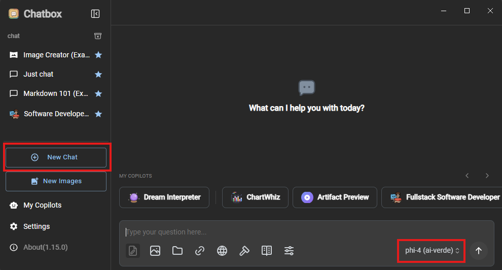

# Chatbox AI

Chatbox AI is a desktop application that works on Windows, MacOS, Android, iOS, Web, and Linux. These instructions should apply for both Windows and MacOS versions with some variations between the two platforms.

## Prerequisites
1. Obtain your AI-VERDE API Key and API URL. [Instructions can be found here](api-token.md).
2. Note the model(s) you want to configure for Claude Code. [Instructions can be found here](api-key-models.md).
3. Install Chatbox AI by visiting this page: https://chatboxai.app/en#download.
4. The remaining instructions Chatbox AI installed.

## 1. Configure AI-VERDE in Chatbox AI

For these steps, you can refer to the screenshot below

1. Launch Chatbox AI
2. Click on Settings
3. Click on Model Provider
4. Click the "+ Add" button 
{: style="width:95%"} 
5. Enter "ai-verde" in the Name field
6. Leave API Mode to "OpenAI API Compatible"
7. Click Add button 
{: style="width:80%"} 
You should then be shown the ai-verde configuration panel on the right.
8. Enter (or paste) your AI-VERDE Key in the API Key field
9. Enter (or paste) the AI-VERDE API URL in the API Host field
{: style="width:80%"}
10. In the model section, click on the "New" button, and a new model dialog box will be shown
11. Enter the model in "Model ID" field
12. In the capabilities, click on the capabilities if you know the model supports vision, reasoning, or tool use.
!!! Note
    Capabilities for a model can be modified at a later time.
13. Click on the "Save" button 
{: style="width:80%"} 
14. You can repeat steps 10-13 to add additional models
15. Optionally, after adding one or more models, you can click on the "Check" button to test the connection to AI-VERDE

Now you're ready to begin chatting!

## 2. Using Chatbox AI with configured models

1. At any time, you can click on the "New Chat" button or click on a previous conversation on the left panel
2. Select the model for this chat session, if necessary 
{: style="width:95%"} 
3. Enter your request in the chat textbox to begin chatting with the model

There is a lot of functionality provided by Chatbox AI (as with many other chat interfaces). Feel free to explore!